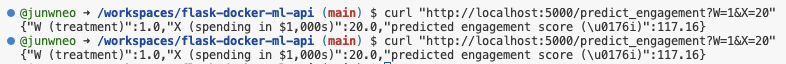
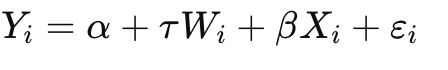

# ATE Estimation Report

## 📘 Description of Data

This dataset contains simulated observations from 20 corporations, each with:

- A **stakeholder engagement score** (Y)
- A **binary treatment indicator** (W) indicating participation in a carbon offset program
- **Annual sustainability spending** in \$1,000s (X)

---

## 🧠 Regression Model

We estimate:

\[
Y_i = \alpha + \tau W_i + \beta X_i + \varepsilon_i
\]

---

## 📊 Results

- **Intercept (α):** 95.966  
- **Average Treatment Effect (τ):** −9.106  
- **Effect of Spending (β):** 1.515  

---
# Answer

## 1(b) Estimated ATE (τ̂) and Its Statistical Significance

We estimate the causal effect of participation in a **carbon offset program** on a corporation’s **stakeholder engagement score**, controlling for **annual sustainability spending**.

Using a linear regression model of the form:

\[
Y_i = \alpha + \tau W_i + \beta X_i + \varepsilon_i
\]

we obtain the following estimates:

- **Intercept (α):** 95.966
- **Average Treatment Effect (τ̂):** −9.106
- **Coefficient for Spending (β):** 1.515

**Estimated Average Treatment Effect (τ̂):**  
The regression analysis estimates the ATE to be **−9.106**, indicating that **participation in the carbon offset program is associated with a decrease of approximately 9.1 points** in the stakeholder engagement score, after controlling for annual spending on sustainability initiatives.

**Statistical Significance:**  
This effect is **statistically significant at the 1% level** (*p* < 0.001), with a **95% confidence interval of [−13.44, −4.77]**. This suggests that the negative association between treatment and engagement is unlikely due to chance, even when accounting for differences in sustainability spending across corporations.

The coefficient for **sustainability spending (X)** is also **statistically significant** (*p* < 0.01), with a **positive estimate of 1.515**, confirming that **increased investment in sustainability is associated with higher engagement scores**.

---

## 1(c) Assumptions Required for a Causal Interpretation of τ̂

To interpret \( \hat{\tau} \) as a **causal effect** (i.e., the true impact of carbon offset program participation on engagement), the following assumptions must hold:

1. **Unconfoundedness (Ignorability):**  
   Given the observed covariate \( X \) (annual sustainability spending), the assignment to treatment (W) is assumed to be independent of potential outcomes. This means there are no **unobserved confounders** that influence both a company’s decision to participate and its engagement score. Violation of this assumption would bias the ATE estimate.

2. **Positivity (Overlap):**  
   Every corporation has a **non-zero probability** of receiving either the treatment or control condition for any value of \( X \). Without overlap, it becomes impossible to estimate the counterfactual outcomes for some groups.

3. **SUTVA (Stable Unit Treatment Value Assumption):**  
   Each corporation’s outcome is affected **only by its own treatment status**, and there are no spillover effects. Also, the treatment (participation in the carbon offset program) is assumed to have **a single, consistent version** across all corporations.

If these assumptions are satisfied, the estimated coefficient \( \hat{\tau} \) represents the **Average Treatment Effect (ATE)** of participating in the carbon offset program on stakeholder engagement scores.

---

## 2(c) Predicted Engagement Score (Ŷi)

We tested the `/predict_engagement` API using the following input values:

- **Wi = 1** (corporation participated in the carbon offset program)
- **Xi = 20** (corporation spent $20,000 on sustainability initiatives)

### API Response:



```json
{
  "W (treatment)": 1.0,
  "X (spending in $1,000s)": 20.0,
  "predicted engagement score (Ŷi)": 117.16
}
```

---
## 🧠 Explanation of Components in `app.py`
`app.py` is a Flask-based web API that:
* Loads and fits a regression model (using statsmodels)
* Exposes endpoints to:
    * View estimated model parameters (like ATE)
    * Predict stake holder engagement based on new inputs

---
1. Import Statements

```python
from flask import Flask, request, jsonify
import pandas as pd
import statsmodels.api as sm
```

* `Flask`: Used to create the web app and API routes
* `request`: Handles incoming HTTP requests (e.g., query parameters)
* `jsonify`: Sens JSON responses
* `pandas`: Manages and manipulates tabular data
* `statsmodels`: Used to build and fit the regression model with statistical summaries

---
2. Initialize Flask App

```python
app = Flask(__name__)
```
* Initializes a Flask web server to handle requests

---
3. Load and Prepare Data

```python
data = pd.DataFrame({ ... })
```
* Loads the dataset directly into a pandas DataFrame. This includes:
    * `Y`: stakeholder engagement score
    * `W`: binary treatment indicator
    * `X`: sustainability spending (in $1,000s)

---
4. Train the Regression Model

```python
X_model = sm.add_constant(data[["W", "X"]])
y_model = data["Y"]
model = sm.OLS(y_model, X_model).fit()
```

* Adds a constant column for the intercept
* Fits a linear regression:

* `model.params` gives α (intercept), τ (ATE), and β (effect of spending).

---
5. Route: `/estimate_ate`

```python
@app.route("/estimate_ate")
def estimate_ate():
    return jsonify({...})
```
* Returns the estimated regression coefficients:
    * Intercept (α)
    * Treatment effect/ATE(τ)
    * Spending coefficient (β)

---
6. Route: `/predict_engagement`

```python
@app.route("/predict_engagement", methods=["GET"])
def predict_engagement():
    ...
```

* Accepts `W` and `X` as query parameters 
* Computes predicted engagement score Yi​^
* Returns it as JSON

---

7. Run the App

```python
if __name__ == "__main__":
    app.run(host="0.0.0.0", port=5000)
```

* Starts the Flask server on all available interfaces (useful for Docker)
* Default port is 5000

---

## Why Dockerfile is needed
* Defines what base image to use (e.g., Python)
* Installs dependencies from `requirements.txt`
* Copies your app files
* Run the Flask app

Docker allows one to package their app, its dependencies, and environment into a lightweight, portable container

This makes it:
* Easy to run anywhere (local, server, cloud)
* Isolated from system-specific dependencies or Python version mismatches
* Perfect for deployment, collaboration and reproducibility

## 📦 How Containerization Improves Reproducibility

**Containerization**, using tools like Docker, significantly enhances the reproducibility of computational projects and APIs. It ensures that your application runs the same way regardless of the environment.

### ✅ 1. Environment Consistency
Containers package not just your code, but the **entire environment** — including the operating system layer, Python version, libraries, and dependencies. This guarantees that the behavior of your application remains consistent across machines.

### ✅ 2. Elimination of "It Works on My Machine"
By isolating the runtime environment, containers avoid issues arising from version conflicts or missing dependencies, making bugs easier to reproduce and fix.

### ✅ 3. Version Control for Environments
A `Dockerfile` serves as a **blueprint of the environment**, allowing you to track changes and recreate exact conditions in the future. This is critical for research, audit trails, or long-term project maintenance.

### ✅ 4. Portability and Shareability
Container images can be **shared easily** and run anywhere Docker is supported — across development machines, CI pipelines, and cloud deployments — without additional setup.

### ✅ 5. Integration with Automation
Containers are compatible with automated testing and deployment pipelines (e.g., GitHub Actions, Jenkins), allowing you to **test and deploy reproducibly** every time changes are made.

---

### 🔁 In Summary:

> **Containerization makes your application self-contained, portable, and deterministic — enabling precise reproducibility across machines, environments, and time.**
