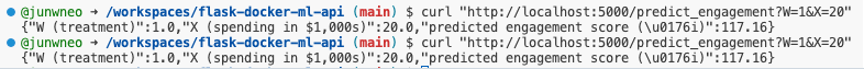

# ATE Estimation Report

**Prepared for:** Assignment Submission  
**Date:** April 2025

---

## Question 1: Average Treatment Effect (ATE)

### 1(a) Linear Regression Estimation

We fit a linear regression model using the form:

```
Yᵢ = α + τ·Wᵢ + β·Xᵢ + εᵢ
```

Where:

- **Yᵢ**: Observed stakeholder engagement score  
- **Wᵢ**: Binary treatment indicator (1 = participated, 0 = did not participate)  
- **Xᵢ**: Annual sustainability spending ($1,000s)  
- **α**: Intercept  
- **τ**: Average Treatment Effect (ATE)  
- **β**: Coefficient for sustainability spending

---

### 1(b) Estimated ATE and Statistical Significance

Estimated coefficients from the regression model are:

- **Intercept (α):** 95.966  
- **Average Treatment Effect (τ̂):** −9.106  
- **Coefficient for Spending (β):** 1.515

The ATE estimate **τ̂ = −9.106** indicates that participation in the carbon offset program is associated with a decrease of approximately 9.1 points in the stakeholder engagement score, controlling for sustainability spending.

This effect is **statistically significant at the 1% level** (*p* < 0.001), with a **95% confidence interval of [−13.44, −4.77]**. The coefficient for spending (**β = 1.515**) is also statistically significant (*p* < 0.01), indicating a positive association between sustainability spending and engagement.

---

### 1(c) Assumptions Required for Causal Interpretation

For **τ̂** to be interpreted as a **causal effect**, the following key assumptions from the Rubin Causal Model must hold:

1. **Unconfoundedness (Ignorability)**  
   Conditional on the observed covariate X(annual sustainability spending), the treatment assignment W is assumed to be independent of the potential outcomes. This means that there are no unobserved confounders that affect both the likelihood of participating in the carbon offset program and the stakeholder engagement score. Violating this assumption would lead to biased estimates of the ATE.

2. **Positivity (Overlap)**  
   For every value of the covariate X, each unit (corporation) has a **non-zero probability** of receiving either the treatment or control. This ensures that we have sufficient data to estimate both potential outcomes for each subgroup. Without overlap, the ATE is not identifiable for certain parts of the population.

3. **SUTVA (Stable Unit Treatment Value Assumption)**  
   Each unit’s potential outcome depends **only on its own treatment assignment**, and not on the treatment status of other units (i.e., no spillover or interference). Additionally, the treatment must be **well-defined and consistent** across all treated units — meaning all corporations receive the same version of the carbon offset program.

---

## Question 2: Codespaces, Flask & Docker

### 2(a) Dockerized Codespaces Setup

A GitHub repository was created and configured with a Dockerfile to define the environment. The container installs required Python dependencies and sets up the Flask server. This enables development in GitHub Codespaces without local setup.

---

### 2(b) Flask API for Prediction

The Flask app loads the trained regression model and exposes a `/predict_engagement` endpoint. The API accepts two parameters (`W` and `X`), and returns the predicted engagement score **Ŷᵢ**.

---

### 2(c) API Test with Sample Input

**Inputs used:**

- **W = 1** (participated in carbon offset program)  
- **X = 20** (i.e., $20,000 on sustainability)

**API Response:**

```json
{
  "W (treatment)": 1.0,
  "X (spending in $1,000s)": 20.0,
  "predicted engagement score (Ŷi)": 117.16
}
```



---

## Explanation of Files and Reproducibility

- **app.py**  
  Defines the Flask web API and includes endpoints for predicting stakeholder engagement scores and retrieving regression model estimates. It loads the trained model and handles HTTP requests.

- **Dockerfile**  
  Specifies the base image, dependencies, and commands to run the Flask application. This ensures the app runs consistently across machines using a containerized environment.

- **requirements.txt**  
  Lists all the Python libraries needed to run the API, such as Flask, pandas, and statsmodels. This allows for quick environment setup using package managers like `pip`.

- **Containerization**  
  Containerization ensures the entire application — code, dependencies, and runtime environment — behaves the same across different systems. It eliminates “it works on my machine” issues, improves reproducibility, supports version control for environments, and simplifies sharing and deployment across cloud or CI/CD platforms.
